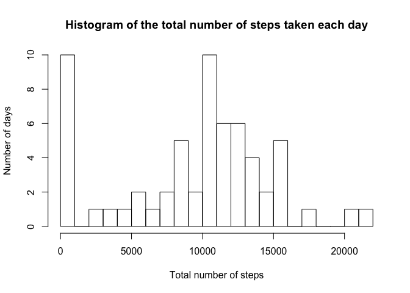

# Reproducible Research: Peer Assessment 1


## Loading and preprocessing the data

1. Load the data to dat


```r
dat <- read.csv("activity.csv")
```

2. The format of dat is data.frame

## What is mean total number of steps taken per day?

1. Calculate the total number of steps taken per day


```r
steps_day <- tapply(dat$steps,dat$date,sum,na.rm=TRUE)
```

2. Make a histogram of the total number of steps taken each day


```r
hist(steps_day, breaks = 20, main = "Histogram of the total number of steps taken each day", xlab = "Total number of steps", ylab = "Number of days")
```


3. Of the total number of steps taken per day, the _mean_ is **9354.2295082**
and the _median_ is **10395**

## What is the average daily activity pattern?

1. Make a time series plot of the 5-minute interval(x-axis) and the average number of steps
taken, averaged across all days(y-axis)


```r
steps_interval <- tapply(dat$steps,dat$interval,mean,na.rm=TRUE)
plot(steps_interval, type = "l", xlab = "Interval", ylab = "Average number of steps")
```



2. The No.**104** 5-minute interval, on average across all the days in the dataset, contains the maximum number of steps.

## Imputing missing values

Note that there are a number of days/intervals where there are missing values (coded as 𝙽𝙰). The presence of missing days may introduce bias into some calculations or summaries of the data.

1. The _tatal number_ of mission values in the dataset is **2304**

2. Devise a strategy for filling in all of the missing values in the dataset. The strategy does not need to be sophisticated. For example, you could use the mean/median for that day, or the mean for that 5-minute interval, etc.

3. Create a new dataset that is equal to the original dataset but with the missing data filled in.


```r
loc <- is.na(dat$steps)
intval_loc <- dat$interval[loc]
dat_new <- dat
dat_new$steps[loc] <- steps_interval[as.character(intval_loc)]
```

4. Make a histogram of the total number of steps taken each day and Calculate and report the mean and median total number of steps taken per day. Do these values differ from the estimates from the first part of the assignment? What is the impact of imputing missing data on the estimates of the total daily number of steps?


```r
steps_day_new <- tapply(dat_new$steps,dat_new$date,sum,na.rm=TRUE)
hist(steps_day_new, breaks = 20, main = "Histogram of the total number of steps taken each day", xlab = "Total number of steps", ylab = "Number of days")
```


Of the total number of steps taken per day, the _mean_ is **1.0766189\times 10^{4}** and the _average_ is **1.0766189\times 10^{4}**.

Obviously, the mean and average total numbers of steps taken per day is lager than befor.

## Are there differences in activity patterns between weekdays and weekends?

For this part the weekdays() function may be of some help here. Use the dataset with the filled-in missing values for this part.

1. Create a new factor variable in the dataset with two levels – “weekday” and “weekend” indicating whether a given date is a weekday or weekend day.


```r
library(timeDate)
wd <- dayOfWeek(as.timeDate(dat$date))
wdlev <- as.factor(c("weekday","weekend"))
dat_new <- data.frame(dat_new, week = wdlev[1])
dat_new$week[(wd=="Sat"|wd=="Sun")] <- wdlev[2]
```

2. Make a panel plot containing a time series plot (i.e. 𝚝𝚢𝚙𝚎 = "𝚕") of the 5-minute interval (x-axis) and the average number of steps taken, averaged across all weekday days or weekend days (y-axis). See the README file in the GitHub repository to see an example of what this plot should look like using simulated data.


```r
library(dplyr)
```

```
## 
## Attaching package: 'dplyr'
```

```
## The following objects are masked from 'package:stats':
## 
##     filter, lag
```

```
## The following objects are masked from 'package:base':
## 
##     intersect, setdiff, setequal, union
```

```r
a <- filter(dat_new, week=="weekday")
b <-filter(dat_new, week=="weekend")

aa <- tapply(a$steps,a$interval, mean, na.rm=TRUE)
bb <- tapply(b$steps,b$interval, mean, na.rm=TRUE)

aa <- data.frame(steps=aa, week=wdlev[1], interval=as.numeric(rownames(aa)))
bb <- data.frame(steps=bb, week=wdlev[2], interval=as.numeric(rownames(bb)))

steps_interval_week <- rbind(aa,bb)
library(lattice)
xyplot(steps ~ interval | week, data=steps_interval_week, xlab = "Interval", ylab = "Numbers of steps", type="l", layout = c(1,2))
```


